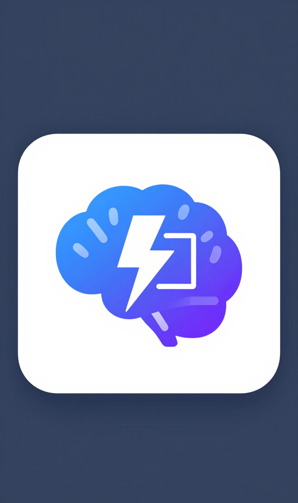
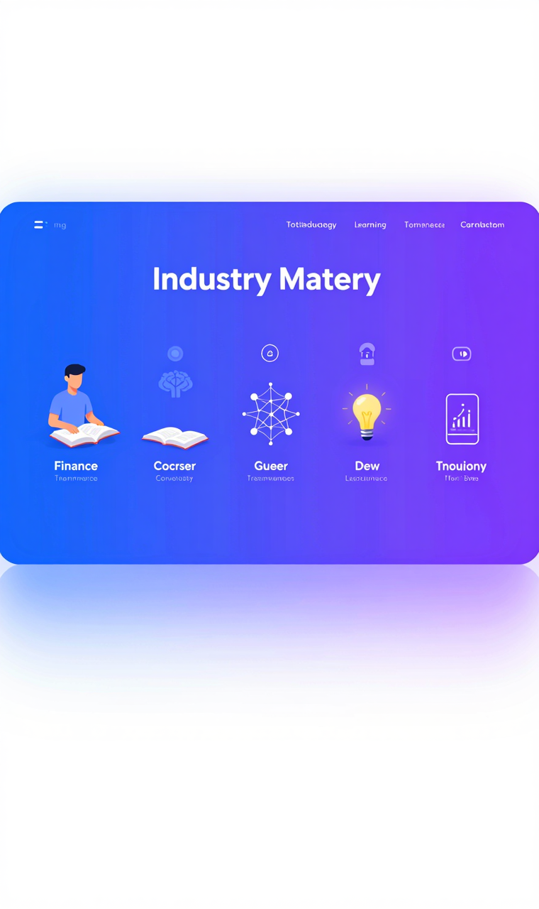

# 行业速成大师 (chuinb-skill)

<p align="center">
  
</p>

<p align="center">
  <strong>让你在几小时内从行业小白变成内行人</strong>
</p>

<p align="center">
  
</p>

---

这是一个 Claude Code 技能（skill），帮助你快速掌握任何陌生的行业、领域或技能。它会自动搜索最新信息、下载相关图片和视频、生成 AI 概念图，最终输出一份精美的学习笔记。

---

## 这个技能能帮你做什么？

想象一下这些场景：

- 下周要和投资人聊区块链，但你完全不懂？
- 想转行到新能源行业，需要快速了解行业全貌？
- 朋友约你聊咖啡文化，你想显得很懂行？

**行业速成大师**会帮你：

1. 用最简单的语言解释行业本质（连12岁小孩都能听懂）
2. 教你行业黑话，让你说话像个内行人
3. 介绍必知的关键人物和经典案例
4. 生成精美的图片和视频，让学习更生动
5. 提供闪卡和测验，帮你巩固记忆
6. 最后保存成一份可以随时翻阅的笔记

---

## 安装指南（超简单！）

> 💡 **所有步骤都可以直接在 Claude Code 中用自然语言完成，不需要手动输入命令！**

### 第一步：确认你已经安装了 Claude Code

如果你能在终端里输入 `claude` 并看到 Claude 的界面，说明已经安装好了。

还没安装？访问 [Claude Code 官网](https://claude.ai/code) 按照指引安装。

### 第二步：安装这个技能

打开 Claude Code，直接说：

```
帮我把 https://github.com/yizhiyanhua-ai/chuinb-skill 这个技能安装到 ~/.claude/skills 目录
```

Claude 会自动帮你下载并安装。

### 第三步：安装依赖技能

这个技能需要两个辅助技能来实现图片生成和媒体下载功能。对 Claude 说：

```
帮我安装这两个技能到 ~/.claude/skills 目录：
- https://github.com/anthropics/claude-code-skills/tree/main/skills/zimage-skill
- https://github.com/anthropics/claude-code-skills/tree/main/skills/media-downloader
```

> 💡 **这两个技能的作用：**
> - **zimage-skill**：使用 AI 生成概念图、流程图等
> - **media-downloader**：从网络下载图片和视频素材

### 第四步：安装依赖工具

继续对 Claude 说：

```
帮我安装 chuinb-skill 需要的依赖：yt-dlp、ffmpeg 和 Pillow
```

Claude 会自动检测你的系统并安装所需工具。

### 第五步：配置 API 密钥

这个技能需要两个免费的 API 密钥：

#### 1. 获取 ModelScope API Key（用于 AI 生成图片）

1. 打开 https://modelscope.cn
2. 注册账号（可以用手机号）
3. 登录后，点击右上角头像 → "我的访问令牌"
4. 创建新令牌，复制它

#### 2. 获取 Pexels API Key（用于下载图片，可选）

1. 打开 https://www.pexels.com/api/
2. 注册账号
3. 点击 "Your API Key" 获取密钥

#### 3. 让 Claude 帮你配置

拿到密钥后，对 Claude 说：

```
帮我配置环境变量：
MODELSCOPE_API_KEY=你的ModelScope密钥
PEXELS_API_KEY=你的Pexels密钥
```

Claude 会自动帮你添加到配置文件。

### 第六步：验证安装

对 Claude 说：

```
检查一下 chuinb-skill 的依赖是否都安装好了
```

Claude 会帮你检查并告诉你结果。

---

## 使用方法

### 直接对话（推荐）

打开 Claude Code，直接用自然语言说：

```
帮我快速了解私募股权行业
```

```
我想成为咖啡行业的内行人
```

```
下周要和区块链的人聊天，帮我速成
```

### 使用命令

```
/chuinb 半导体行业
```

```
/master venture capital
```

### 使用流程

1. **回答几个问题**：Claude 会先问你学习目标、背景和时间预算
2. **等待研究**：Claude 会自动搜索最新信息、下载图片视频
3. **选择保存位置**：Claude 会问你想把笔记保存到哪里
4. **获得学习笔记**：一份精美的 Markdown 文件，包含图片和视频

---

## 输出示例

运行后，你会得到这样的文件结构：

```
你指定的目录/
├── 私募股权行业速成指南.md    # 主文档（可以用 Obsidian 打开）
└── media/                      # 媒体文件夹
    ├── diagram-value-chain.jpg # AI 生成的价值链图
    ├── person-xxx.jpg          # 下载的人物照片
    └── video-explained.mp4     # 下载的教学视频
```

笔记内容包括：
- 一句话看懂行业
- 行业本质分析
- 专业术语表
- 必知人物介绍
- 经典案例分析
- 视频片段
- 闪卡和测验
- 行动清单

---

## 常见问题

### Q: 生成图片时报错 "API Key required"

对 Claude 说：`帮我检查 MODELSCOPE_API_KEY 环境变量是否配置正确`

### Q: 视频下载失败

对 Claude 说：`帮我安装 yt-dlp 和 ffmpeg`

### Q: 图片下载失败

这个技能会优先使用 AI 生成图片，所以即使图片下载失败也没关系。如果你想下载网络图片，需要配置 Pexels API Key。

### Q: 笔记里的图片/视频显示不出来

这个技能生成的笔记使用 Obsidian 的语法（`![[文件名]]`）。推荐使用 [Obsidian](https://obsidian.md) 打开笔记。

### Q: 可以用中文还是英文？

都可以！这个技能支持中英文双语。

---

## 技术支持

遇到任何问题，直接在 Claude Code 中描述你的问题，Claude 会帮你解决。

---

## 更新日志

### v1.1.0 (2026-01-22)
- 新增：智能媒体获取（事实性图片下载 + 概念图 AI 生成）
- 新增：保存前询问用户路径
- 新增：中英文 README 文档
- 优化：更清晰的执行流程

### v1.0.0
- 初始版本发布
